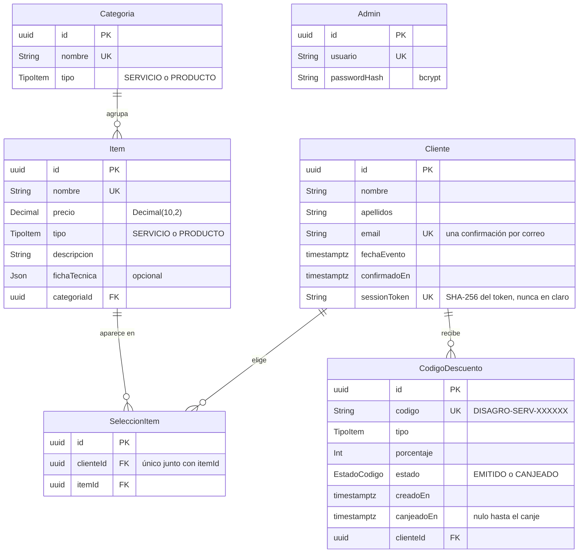

# Feria de Promociones Disagro

Plataforma de confirmación de asistencia a la feria de promociones de Disagro. El
cliente confirma su asistencia, elige servicios y productos, ve en vivo el descuento
que va obteniendo y recibe códigos de descuento y un portafolio personalizado. Un panel
de administración muestra los clientes confirmados, sus códigos y las métricas de la feria.

## Pruébelo en vivo

La plataforma está desplegada en **https://jeanrodas.lat**.

- Formulario de confirmación: https://jeanrodas.lat
- Panel de administración: https://jeanrodas.lat/admin. Las credenciales del
  despliegue en vivo se entregan por separado; no están en este repositorio.

También se puede levantar completa en local con un solo comando: ver
[Cómo levantar todo el proyecto](#cómo-levantar-todo-el-proyecto-docker).

## Arquitectura: dos aplicaciones

Son dos aplicaciones independientes que se integran por una API HTTP, como las
construirían dos equipos distintos:

| Parte | Dónde | Qué es |
|---|---|---|
| **Backend** | la raíz de este repositorio | API REST: Node, TypeScript, Express 5, Prisma y PostgreSQL. Toda la lógica de negocio: descuentos, códigos, sesiones, canje y métricas. |
| **Frontend** | [`frontend/`](frontend/) | SPA: React, TypeScript, Vite y Tailwind. Consume la API. |

El proyecto empezó como backend y, al estructurarse en dos partes, el backend se quedó
en la raíz y el frontend en su carpeta. Por eso este README es a la vez la portada del
proyecto y la documentación técnica del backend; el detalle del frontend está en
[`frontend/README.md`](frontend/README.md).

- **El backend es autónomo**: se prueba entero por su API, sin interfaz (ver
  [Endpoints](#endpoints)).
- **El frontend no guarda ni decide nada por su cuenta**: todo sale de la API. La única
  regla que replica es la vista previa del descuento mientras el cliente elige, y solo
  para mostrarla; el cálculo que vale lo hace el backend al confirmar.

```
navegador → nginx (sirve la SPA y reenvía /api) → backend → PostgreSQL
            en producción, delante de todo: Caddy (HTTPS)
```

## Lo destacado

- **Dos niveles de sesión.** El cliente entra sin contraseña, con un token aleatorio de
  256 bits (guardado como hash) en una cookie httpOnly y en el enlace del correo. El
  admin, con usuario, contraseña bcrypt y JWT en su propia cookie.
- **Códigos de descuento con aleatoriedad criptográfica** (`crypto.randomBytes`, sin
  sesgo de módulo), únicos por restricción de la base.
- **Canje atómico**: un solo `UPDATE … WHERE estado = 'EMITIDO'`; con peticiones
  simultáneas, solo una gana.
- **Dinero sin coma flotante**: `Decimal` en la base y en el dominio, texto en la API.
- **Rate limiting por IP** en login, confirmación y canje, contando bien los proxies.
- **Todo dockerizado**: base, migraciones y seed, API y frontend con un
  `docker compose up`. En producción, HTTPS automático con Caddy.
- **Datos de demostración** sembrados por el mismo flujo que una confirmación real.
- **Correo transaccional** con Resend, como respaldo de lo que ya se ve en pantalla.

## Cómo levantar todo el proyecto (Docker)

Solo hace falta **Docker** con Docker Compose. No hace falta Node.

```bash
git clone https://github.com/jeanrodas/disagro.git
cd disagro
cp .env.example .env
docker compose up -d --build
```

La primera vez tarda unos minutos, porque construye las imágenes. Después:

| Qué | Dónde |
|---|---|
| La app | **http://localhost:8090** |
| Panel de administración | **http://localhost:8090/admin** |
| Usuario y contraseña del panel (solo en local) | `admin` / `admin-demo-2026` |

El `.env.example` trae valores **de demostración** que funcionan tal cual. Son públicos a
propósito y solo sirven para una instalación local: el despliegue en vivo usa su propio
fichero con secretos generados, y su contraseña no está aquí.

- **Si un puerto está ocupado**, cámbialo en el `.env`: `PUERTO_APP` es el de la app
  (8090) y `POSTGRES_PORT` el de la base publicada en el host (5434).
- **Para pararlo**: `docker compose down` conserva los datos; `docker compose down -v`
  borra la base de datos.
- **Para ver qué pasa**: `docker compose logs -f`.

## Datos de demostración

El seed crea 6 clientes **de prueba** ([`prisma/seed/demo.data.ts`](prisma/seed/demo.data.ts))
para que el panel de administración no arranque vacío. Entre todos cubren cada caso del
sistema: 5% y 3% en servicios, 5% y 3% en productos, los dos descuentos a la vez y ningún
descuento, con códigos EMITIDOS y CANJEADOS. Son personas ficticias con correos de
dominios `.gt` que no existen.

- **Pasan por el flujo real.** Cada uno se valida con el mismo esquema que
  `POST /api/confirmar` y se crea con `confirmarAsistencia()`: precios de la base,
  `calcularDescuentos` y el generador de códigos. Los canjes usan `canjearCodigo()`.
- **Solo se crean los que faltan**, por email. Repetir el seed (ocurre en cada
  `docker compose up`) no duplica nada ni toca a ningún otro cliente; si un correo de demo
  ya lo usa otra persona, se deja como está.
- **`SEED_DEMO=false`** los omite, por ejemplo en un lanzamiento real donde no deben
  mezclarse con las métricas.

## Correo

Los códigos y el portafolio se muestran en pantalla nada más confirmar. El correo es un
**respaldo**: repite los códigos y trae el enlace para volver al portafolio desde otro
dispositivo.

- **Requiere `RESEND_API_KEY`.** En local viene vacía: todo funciona igual, y el envío se
  omite dejando un aviso en el log del backend (`docker compose logs backend`).
- **Un fallo de Resend no afecta a la confirmación**: el correo se envía después de
  responder, y el error solo queda en el log.
- **Para verlo llegar de verdad**, confirma una asistencia en https://jeanrodas.lat.

## Frontend

El detalle del frontend (pantallas, desarrollo con Vite, imagen de nginx) está en
[`frontend/README.md`](frontend/README.md).

---

# Backend: detalle técnico

Todo lo que sigue documenta el backend, que es la raíz de este repositorio.

## Stack

Node.js · TypeScript · Express 5 · PostgreSQL · Prisma 7 · JWT · bcrypt · Resend · Docker

## Desarrollo sin Docker

Para trabajar en el código con recarga automática. Requisitos: Node.js 22 o superior y
Docker, solo para la base de datos.

```bash
cp .env.example .env     # funciona tal cual en local
npm install
npm run db:up            # solo Postgres, publicado en localhost:5434
npm run db:deploy        # aplica las migraciones
npm run db:seed          # catálogo (17 items), admin inicial y 6 clientes de demostración
npm run dev              # API en http://localhost:3000
```

Y el frontend, en otra terminal: `cd frontend && npm install && npm run dev`
(http://localhost:5175; ver [`frontend/README.md`](frontend/README.md)).

## Scripts

| Comando | Qué hace |
|---|---|
| `npm run dev` | Servidor con recarga automática |
| `npm run build` / `npm start` | Compila a `dist/` y lo ejecuta |
| `npm test` / `test:watch` | Tests con vitest (ver [Tests](#tests)) |
| `npm run typecheck` | Revisa tipos sin compilar |
| `npm run db:up` / `db:stop` | Solo Postgres en Docker, para desarrollar sin Docker |
| `npm run db:migrate` / `db:deploy` | Migraciones en desarrollo / producción |
| `npm run db:generate` | Regenera el cliente de Prisma |
| `npm run db:seed` / `db:seed:admin` | Catálogo, admin y clientes de demo / solo el admin |
| `npm run db:studio` | Explorador de la base de datos |
| `npm run docker:up` / `docker:down` / `docker:logs` | Atajos de `docker compose up -d --build`, `down` y `logs -f` |

## Modelo de datos

Seis tablas en PostgreSQL, definidas en [`prisma/schema.prisma`](prisma/schema.prisma),
que es la fuente de verdad. El diagrama muestra los campos principales de cada una.



`Admin` no se relaciona con nada: el panel lee los datos de los clientes, pero ningún
registro pertenece a un administrador.

**Decisiones de modelado**

| Decisión | Por qué |
|---|---|
| **`Decimal(10,2)` para el precio**, no `Float` | En coma flotante, 524.07 + 500.00 + 475.93 da 1500.0000000000002, y la regla "servicios por encima de Q1,500" daría un 5% que no corresponde. |
| **`SeleccionItem` como tabla intermedia**, con `@@unique([clienteId, itemId])` | Es la relación muchos a muchos entre cliente e item. Frente a un arreglo de ids, garantiza que cada item exista (clave foránea), impide elegir dos veces el mismo y permite contar los items más elegidos con un índice (`@@index([itemId])`). |
| **`sessionToken` guarda el SHA-256** del token, y es único | El token en claro solo vive en la cookie y en el enlace del correo. Si se filtrara la base, los hashes no servirían para entrar. |
| **`CodigoDescuento.estado` como enum** (`EMITIDO` / `CANJEADO`), con `canjeadoEn` | El canje es un solo `UPDATE … WHERE estado = 'EMITIDO'`: quien llega segundo ya no encuentra la fila en ese estado. El enum impide estados inventados, y `canjeadoEn` queda nulo hasta el canje. |
| **`codigo` único** | Dos clientes nunca comparten código. Si el generador aleatorio repitiera uno, la inserción falla y se reintenta con otro. |
| **`email` único en `Cliente`** | Una confirmación por persona. La comprobación previa da un 409 claro; la restricción cubre además dos peticiones simultáneas que esa comprobación no ve. |
| **UUID como identificador** (tipo nativo `uuid` de Postgres) | No son enumerables: con ids 1, 2, 3… bastaría probar números para recorrer `/api/admin/clientes/:id`. |
| **Borrado en cascada desde `Cliente`, restringido desde `Item` y `Categoria`** | Si se borra un cliente, sus selecciones y códigos se van con él. No se puede borrar un item que alguien eligió, ni una categoría con items. |
| **Fechas `timestamptz`** | Guardan el instante con zona horaria. `fechaEvento` se guarda como la medianoche de ese día en Guatemala. |
| **`tipo` repetido en `Categoria` y en `Item`** | Desnormalización consciente: el catálogo se filtra por tipo sin hacer un JOIN (`@@index([tipo])`). El seed comprueba que los dos coincidan. |

**Lo que el esquema no guarda, a propósito**

- **Porcentajes y totales de cada cliente.** Se recalculan desde sus selecciones con la
  misma función de dominio que usa la confirmación: hay una sola fuente de verdad. La
  contrapartida es que `SeleccionItem` no congela el precio del momento, así que si
  cambiara un precio del catálogo, cambiarían también los totales recalculados de
  clientes anteriores. Lo que sí queda fijo es el porcentaje de cada código emitido. En
  un sistema real se guardaría el precio en `SeleccionItem`.
- **El límite de dos códigos por cliente**, uno por tipo. Lo garantiza la lógica de
  confirmación, no la base: no hay un `@@unique([clienteId, tipo])`.

## Endpoints

| Método y ruta | Quién | Para qué |
|---|---|---|
| `GET /health` | — | Estado del servicio y de la base de datos |
| `GET /api/items` | público | Catálogo con filtros `tipo`, `categoria` y `buscar` |
| `GET /api/categorias` | público | Categorías con su cantidad de items |
| `POST /api/confirmar` | público | Confirma asistencia, calcula descuentos y emite códigos |
| `GET /api/portafolio` | cliente | Portafolio del cliente de la sesión |
| `POST /api/sesion` | público | Canjea el token del enlace del correo por la cookie |
| `POST /api/codigos/canjear` | público | Marca un código como canjeado (una sola vez) |
| `POST /api/admin/login` / `logout` | público | Inicia y cierra la sesión del admin |
| `GET /api/admin/me` | admin | Admin autenticado |
| `GET /api/admin/clientes` | admin | Lista paginada con búsqueda; cada cliente trae sus códigos canjeados y el total |
| `GET /api/admin/clientes/:id` | admin | Detalle completo de un cliente |
| `GET /api/admin/metricas` | admin | Totales, ingreso potencial y top de items |

## Variables de entorno

Las de local están en [`.env.example`](.env.example), que funciona tal cual, y las de
producción en [`.env.produccion.example`](.env.produccion.example). Las que cambian por
entorno:

- `APP_URL`: URL pública del frontend (CORS, enlace del correo, `portafolioUrl` del 409).
- `TRUST_PROXY`: cuántos proxies hay delante del backend. De eso depende qué IP ve el
  rate limiting, y el valor correcto depende de dónde corre (tabla de abajo).
- `MAIL_FROM` y `RESEND_API_KEY`: remitente y clave del correo. Sin clave, el correo
  se omite y queda anotado en el log; la confirmación funciona igual.
- `ADMIN_USER` y `ADMIN_PASSWORD`: solo las usa el seed del admin.

| Dónde corre el backend | Proxies delante | `TRUST_PROXY` | Quién lo fija |
|---|---|---|---|
| `npm run dev` (sin Docker) | ninguno | `false` | el `.env` |
| `docker-compose.yml` (desarrollo) | nginx | `1` | el propio compose |
| `docker-compose.prod.yml` (producción) | Caddy y nginx | `2` | el propio compose |

Con un valor menor del que toca, el backend tomaría la IP de un proxy como si fuera la
del cliente y el rate limiting contaría a todo el mundo como un solo visitante. Con uno
mayor, cualquiera podría inventarse la IP en `X-Forwarded-For`.

## Docker: toda la plataforma

El paso a paso está arriba, en
[Cómo levantar todo el proyecto](#cómo-levantar-todo-el-proyecto-docker). Aquí va cómo
está montado.

Cuatro servicios que arrancan en orden, garantizado por `depends_on`:

| Servicio | Qué hace | Arranca cuando |
|---|---|---|
| `postgres` | Base de datos, con volumen persistente | — |
| `migrate` | `prisma migrate deploy` y siembra el catálogo, el admin y los clientes de demo. **Termina** | `postgres` está *healthy* |
| `backend` | La API. No migra | `migrate` terminó **con éxito** |
| `frontend` | nginx: sirve la SPA y hace de proxy a `/api` | `backend` está *healthy* |

Desde cero (`down -v` incluido) tarda unos 35 segundos.

### Dos imágenes del backend, del mismo Dockerfile

- `--target final` (por defecto): **el servidor**. 247 MB. No lleva el CLI de Prisma.
- `--target migrate`: **las herramientas**. Lleva el CLI y `tsx` para el seed.

Migrar es una tarea puntual de despliegue, no algo que el servidor deba saber hacer.
Separarlas quita del runtime el CLI y todo lo que arrastra (Prisma Studio con
`react-dom`, `effect`, `typescript`), que el servidor no usa nunca: de 486 MB a 247 MB.
Además, con varias réplicas del backend, todas intentarían migrar a la vez.

**`migrate deploy`, no `migrate dev`:** `deploy` aplica las migraciones ya versionadas,
sin crear nuevas ni preguntar nada, y no hace nada si ya están aplicadas. `dev` es
interactivo, puede generar migraciones y, si detecta deriva, propone **resetear** la base.
El seed usa `upsert`, así que repetir `up` no duplica el catálogo.

### Comandos

| Comando | Qué hace |
|---|---|
| `docker compose up -d --build` | Levanta la plataforma |
| `docker compose logs -f` | Sigue los logs |
| `docker compose down` | La para y **conserva** los datos |
| `docker compose down -v` | La para y **BORRA la base de datos** |
| `npm run db:up` | Solo Postgres, para desarrollar sin Docker |

### Variables

El `.env` de la raíz sirve a dos entornos, y por eso hay variables con sufijo `_DOCKER`:
en desarrollo la base está en `localhost:5434` y la app en el 5175 de Vite, mientras que
dentro de la red de Docker la base es el servicio `postgres:5432` y la app la sirve nginx.

| Variable | Para qué |
|---|---|
| `PUERTO_APP` | Puerto del host donde queda la app (por defecto 8090) |
| `DATABASE_URL_DOCKER` | Conexión de los contenedores: host `postgres`, puerto 5432 |
| `APP_URL_DOCKER` | URL pública de la app. En producción, el dominio real |
| `JWT_SECRET`, `ADMIN_USER`, `ADMIN_PASSWORD`, `MAIL_FROM`, `RESEND_API_KEY` | Compartidas con el desarrollo |

`TRUST_PROXY` no se define en el `.env` para los contenedores: cada compose lo fija según
cuántos proxies hay delante, `1` en `docker-compose.yml` (nginx) y `2` en
`docker-compose.prod.yml` (Caddy y nginx). Ver la tabla de
[Variables de entorno](#variables-de-entorno).

### Ejecutar solo el backend, sin compose

```bash
docker build -t disagro-backend .
docker run -d -p 127.0.0.1:3000:3000 --env-file backend.env disagro-backend
```

Esta imagen **no migra**: espera a que la base acepte conexiones y arranca el servidor.
Prepara la base antes con la imagen de herramientas:

```bash
docker build --target migrate -t disagro-migrate .
docker run --rm --env-file backend.env disagro-migrate
```

### Producción: VPS con HTTPS (Caddy)

Es la configuración que corre en https://jeanrodas.lat.
[`docker-compose.prod.yml`](docker-compose.prod.yml) añade un quinto servicio, **Caddy**,
que termina el TLS y es el único que publica puertos:

```
internet → Caddy (80/443, HTTPS) → nginx (80, red interna) → backend → postgres
```

```bash
# en el VPS
cp .env.produccion.example .env.produccion    # y cambia TODOS los valores
docker compose -f docker-compose.prod.yml --env-file .env.produccion up -d --build
```

- **HTTPS automático.** Caddy pide y renueva el certificado de Let's Encrypt y redirige
  HTTP a HTTPS sin configurarlo. Los certificados viven en un volumen: si se perdieran
  en cada reinicio, Let's Encrypt acabaría cortando por límite de peticiones.
- **Nada más queda expuesto.** nginx y Postgres pierden sus `ports`: solo se llega a
  ellos por la red interna de Docker.
- **`TRUST_PROXY=2`**, fijado en el propio compose. Con dos proxies delante (Caddy y
  nginx), el backend tiene que descontar dos saltos de `X-Forwarded-For` para leer la IP
  real del cliente. Con `1` leería la de Caddy y el rate limiting por IP contaría a todo
  el mundo como un solo visitante.
- **El `.env` de producción es otro fichero** (`.env.produccion`, tampoco versionado) con
  secretos propios: contraseña de Postgres, `JWT_SECRET` y `ADMIN_PASSWORD` nuevos, nunca
  los de desarrollo. Las variables están en
  [`.env.produccion.example`](.env.produccion.example), cuyos rellenos de `JWT_SECRET` y
  `ADMIN_PASSWORD` son justo los que el backend rechaza: si se olvida cambiarlos,
  producción no arranca con un secreto conocido.
- **La contraseña del admin se aplica al levantar.** El seed es idempotente: si
  `ADMIN_PASSWORD` cambió, actualiza el hash en el primer `up`. Rotarla es editar esa
  línea y volver a levantar.
- **Probar sin dominio.** Con `DOMINIO=localhost`, Caddy usa su CA interno (certificado
  autofirmado, sin Let's Encrypt) y la cadena completa se puede levantar en local:
  `DOMINIO=localhost PUERTO_HTTP=8080 PUERTO_HTTPS=8443 docker compose -f docker-compose.prod.yml …`
  y luego `curl -k https://localhost:8443/api/items`.

## Seguridad: alcance y limitaciones

### Lo que está implementado

| Medida | Dónde |
|---|---|
| Contraseñas con **bcrypt** (costo 12) | `src/lib/password.ts` |
| **JWT HS256** con emisor, audiencia y expiración de 8 h, verificando el algoritmo fijo | `src/lib/jwt-admin.ts` |
| **Cookies httpOnly** para las dos sesiones, `secure` en producción, `sameSite: lax`; la del admin acotada a `/api/admin` | `src/lib/sesion.ts`, `src/lib/jwt-admin.ts` |
| **Token de sesión del cliente guardado como SHA-256**: si se filtra la base, los hashes no sirven para entrar | `src/lib/sesion.ts` |
| **Defensa contra enumeración de usuarios**: el login responde lo mismo exista o no el usuario, y ejecuta bcrypt en ambos casos para que el tiempo no lo delate | `src/services/admin-auth.service.ts` |
| **Códigos con CSPRNG** (`crypto.randomBytes`) y muestreo por rechazo, sin sesgo | `src/domain/codigos.ts` |
| **Canje atómico**: un solo `UPDATE ... WHERE estado = 'EMITIDO'`, así dos peticiones simultáneas no pueden usar el mismo código | `src/services/codigos.service.ts` |
| **Validación y saneamiento de entradas con zod** en todos los endpoints, con errores por campo | `src/schemas/` |
| **Errores sin fugas**: al cliente solo le llega un mensaje; el detalle queda en el log del servidor | `src/middlewares/error.middleware.ts` |
| **helmet** y **CORS** restringido a `APP_URL` con credenciales | `src/app.ts` |
| **Rate limiting por IP** en login, confirmación y canje | `src/middlewares/rate-limit.middleware.ts` |
| **HTTPS en producción**: Caddy obtiene y renueva el certificado, y redirige HTTP a HTTPS | `Caddyfile`, `docker-compose.prod.yml` |
| **Secretos fuera del repositorio**: `.env` y `.env.produccion` ignorados; los ejemplos solo traen valores de demo para local o rellenos que el backend rechaza | `.gitignore`, `.env.example`, `.env.produccion.example` |

**Rate limiting, valores y porqués:**

| Endpoint | Ventana | Límite | Razón |
|---|---|---|---|
| `POST /api/admin/login` | 15 min | 8 intentos **fallidos** | Blanco natural de la fuerza bruta. Los ingresos correctos no gastan cupo, así que el admin legítimo no se queda fuera por su propio uso. |
| `POST /api/confirmar` | 1 hora | 20 | Una persona confirma una vez; el margen cubre a varias que compartan la salida a internet (oficina o wifi de la feria) y corta la creación masiva. |
| `POST /api/codigos/canjear` | 10 min | 30 | Adivinar un código es muy improbable (31⁶ ≈ 887 millones); el límite evita intentarlo en masa. |

Se eligió **límite por IP y no bloqueo de cuenta**: con un único administrador, bloquear
la cuenta tras N fallos permitiría a cualquiera dejar fuera al admin real mandando
contraseñas equivocadas. El límite por IP frena el ataque sin abrir esa vía de
denegación de servicio.

### Lo que NO está y sería el siguiente paso

Esto es una prueba técnica y las medidas son proporcionadas a ese alcance. En un
sistema en producción faltaría:

- **Segundo factor (2FA/TOTP) para el admin.** Hoy una contraseña filtrada da acceso
  completo al panel.
- **Bloqueo o retardo progresivo por cuenta**, combinado con el límite por IP y con
  una forma de desbloqueo verificada, para cubrir ataques distribuidos desde muchas IPs.
- **HSTS.** HTTPS ya es obligatorio en producción (Caddy redirige HTTP a HTTPS y las
  cookies van marcadas `secure`), pero las respuestas no incluyen la cabecera
  `Strict-Transport-Security`, que le diría al navegador que no intente nunca HTTP.
- **Invalidación de sesiones del admin.** El JWT no tiene estado: al cerrar sesión se
  borra la cookie, pero un token copiado antes sigue sirviendo hasta que expira (8 h).
  Se resolvería con una versión de sesión en la tabla `Admin` o una lista de revocados.
- **Auditoría de accesos**: hoy no queda registro de quién entró al panel, desde dónde
  ni qué consultó.
- **Rotación de secretos** (`JWT_SECRET`, claves de API) y almacenamiento en un gestor
  de secretos en vez de un archivo `.env`.
- **WAF y protección ante denegación de servicio** a nivel de infraestructura; el rate
  limiting de la app no sustituye eso.
- **Contador de rate limiting compartido.** Vive en memoria del proceso: con varias
  réplicas cada una contaría por su lado, y haría falta un almacén común (Redis).
- **Rate limiting del canje pensado para el punto de venta.** Si en la feria un mismo
  dispositivo canjeara muchos códigos desde una sola IP, el límite de 30 cada 10
  minutos le quedaría corto: habría que exceptuar esa IP o, mejor, poner el canje
  detrás de la autenticación del punto de venta, que es como iría en un sistema real.
- **Protección CSRF explícita.** Hoy se apoya en `sameSite: lax` y en que las
  operaciones sensibles son `POST` con `Content-Type: application/json`; un token CSRF
  sería lo siguiente.

## Tests

```bash
npm test                   # desde la raíz: los 160
cd frontend && npm test    # solo los del frontend: 61
```

| Qué cubren | Tests |
|---|---|
| Backend: dominio (descuentos, totales, códigos, canje, métricas), validación y plantilla del correo | 88 |
| Backend: coherencia de los datos de demostración con las reglas de descuento | 11 |
| Frontend: vista previa de descuentos (mismos casos frontera que el backend) y formato | 61 |

Desde la raíz se ejecutan los 160 porque vitest, sin configuración que lo acote, recoge
también los del frontend.
